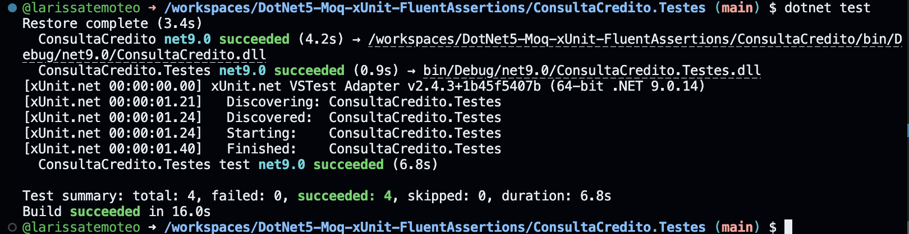
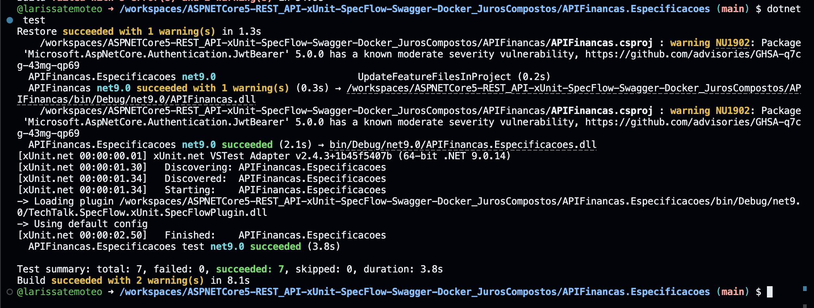

# Aplicando Testes

Repositório da atividade ponderada de Testes de Software.

A proposta foi fazer fork de três repositórios de exemplo do autor Renato Groffe, abrir cada um no GitHub Codespaces, executar os testes e documentar tudo aqui. Este repositório reúne o resultado dos três testes; cada seção abaixo explica um tipo de teste e mostra o print da execução. Os links dos forks estão logo a seguir.

## Links dos forks

Os três repositórios abaixo foram forkados para a minha conta a partir dos originais do Renato Groffe:

- Teste de unidade (xUnit): https://github.com/larissatemoteo/DotNet5-xUnit
- Mock Objects (Moq): https://github.com/larissatemoteo/DotNet5-Moq-xUnit-FluentAssertions
- Teste de aceitação com SpecFlow: https://github.com/larissatemoteo/ASPNETCore5-REST_API-xUnit-SpecFlow-Swagger-Docker_JurosCompostos

---

## 1. Teste de Unidade (xUnit)

O teste de unidade é o tipo de teste mais básico e mais usado. A ideia é testar a menor parte possível do sistema de forma isolada, normalmente um único método, e verificar se ele devolve o resultado certo para determinadas entradas. Como a unidade é testada sozinha, sem depender de banco de dados, internet ou outros componentes, o teste roda rápido e o resultado é sempre o mesmo.

Neste repositório, o teste de unidade valida uma biblioteca de conversão de temperatura. Existe um método `FahrenheitParaCelsius`, que recebe um valor em Fahrenheit e devolve o equivalente em Celsius usando a fórmula `(Fahrenheit - 32) / 1.8`. O resultado ainda é arredondado para duas casas decimais com `Math.Round`.

### Como o teste é aplicado

O framework usado é o xUnit. Em vez de escrever um teste separado para cada valor, o xUnit nso permite criar um único método de teste parametrizado com o atributo `[Theory]`. Cada conjunto de valores de entrada é informado com o atributo `[InlineData]`, e o xUnit executa o método uma vez para cada `[InlineData]`. Por isso, mesmo havendo um só método de teste, o resultado mostra 6 testes executados.

Cada `[InlineData]` traz dois números: o valor em Fahrenheit que será passado para o método e o resultado esperado em Celsius. Dentro do teste, o método é chamado e o valor que ele devolveu é comparado com o esperado usando `Assert.Equal`. Se os dois forem diferentes, o teste falha.

### Cenários de exemplo

Cenário 1 - Ponto de congelamento da água. A entrada é 32 °F e o resultado esperado é 0 °C. Esse é um dos pontos de referência da escala, então serve para confirmar que a conversão funciona no limite inferior. O teste passa a entrada 32 para o método e verifica se o retorno é exatamente 0.

Cenário 2 - Ponto de ebulição da água. A entrada é 212 °F e o resultado esperado é 100 °C. É o outro ponto de referência clássico, no limite superior. O teste confirma que valores mais altos também são convertidos corretamente, garantindo que a fórmula funciona em toda a faixa de valores.

### Resultado da execução

Os 6 testes passaram, sem falhas.

---

## 2. Mock Objects (Moq)

Um Mock Object é um objeto "falso" que imita o comportamento de uma dependência real durante o teste. Ele é útil quando o código que queremos testar depende de outro componente que seria difícil, lento ou imprevisível de usar de verdade, como um serviço externo ou uma consulta a um sistema de outra empresa.

Com o mock, a gente programa exatamente o que essa dependência deve responder em cada situação. Assim dá para testar a lógica do código principal de forma controlada, sem precisar de uma implementação real da dependência.

O teste valida uma rotina de análise de crédito. A classe `AnaliseCredito` tem um método `ConsultarSituacaoCPF` que classifica a situação de um cliente, mas para isso depende da interface `IServicoConsultaCredito`, que consultaria as pendências de um CPF. Essa interface não tem implementação concreta no projeto, então o mock é o que torna o teste possível.

### Como o teste é aplicado

O framework usado é o Moq, em conjunto com o xUnit e o Fluent Assertions. Com o Moq, é criado um objeto falso da interface `IServicoConsultaCredito`. No início do teste, esse objeto é configurado com o método `Setup`, que define qual deve ser a resposta para cada CPF testado: um CPF retorna uma lista vazia de pendências, outro retorna uma lista com pendências, outro retorna nulo e outro provoca uma exceção.

Esse mock é então entregue para a classe `AnaliseCredito`, e o teste verifica se o método de análise classifica a situação corretamente de acordo com o que o mock respondeu. As verificações usam o Fluent Assertions, que deixa o código mais legível com a sintaxe `status.Should().Be(...)` e ainda permite definir uma mensagem personalizada que aparece caso o teste falhe. O importante é entender que o que está sendo testado é a lógica de decisão da `AnaliseCredito`, e não o serviço de consulta, que é simulado.

### Cenários de exemplo

Cenário 1 - Cliente sem pendências. O mock é configurado para devolver uma lista vazia de pendências. Nesse caso, o esperado é que o método de análise classifique o cliente como "sem pendências". O teste confirma que, quando a consulta não encontra nada, a situação retornada é a de um cliente regular.

Cenário 2 - Cliente inadimplente. O mock é configurado para devolver uma lista contendo uma pendência (uma parcela não paga). O esperado é que o método classifique o cliente como "inadimplente". O teste confirma que a regra reage corretamente quando a consulta indica que existe uma restrição.

### Resultado da execução

Os 4 testes passaram, sem falhas.

---

## 3. Teste de Aceitação com SpecFlow (BDD)

O SpecFlow é um framework para BDD, que significa Behavior Driven Development, ou desenvolvimento orientado a comportamento. A ideia do BDD é descrever primeiro o comportamento esperado do sistema em linguagem natural, de um jeito que qualquer pessoa do time consiga ler e entender, mesmo sem saber programar. Depois, cada frase dessa descrição é ligada a um trecho de código que executa o teste de verdade.

Neste repositório, o SpecFlow é aplicado sobre uma API REST feita em ASP.NET Core que calcula juros compostos. Os testes verificam se, dado um valor de empréstimo, um prazo em meses e uma taxa de juros, a API devolve o valor total correto ao final do período.

### Como o teste é aplicado

O teste tem duas partes. A primeira é um arquivo `.feature`, escrito na sintaxe Gherkin. Nele, a funcionalidade é descrita em cenários, e cada cenário usa as palavras-chave `Dado`, `E`, `Quando` e `Então`: o `Dado` e o `E` definem a situação inicial (valor, prazo e taxa), o `Quando` representa a ação de solicitar o cálculo, e o `Então` informa o resultado esperado.

A segunda parte é o arquivo de Step Definition, em C#. Ele funciona como uma ponte: cada frase do arquivo `.feature` é ligada a um método através dos atributos `[Given]`, `[When]` e `[Then]`. Os valores que aparecem nas frases (como o valor do empréstimo) são capturados automaticamente e passados para os métodos. O método ligado ao `[When]` chama o cálculo de juros compostos da API, e o método ligado ao `[Then]` compara o resultado obtido com o esperado usando `Assert.Equal`. Como o cálculo trabalha com valores de ponto flutuante, a comparação é feita considerando duas casas decimais, o que garante que o valor calculado seja validado corretamente contra o valor esperado.

### Cenários de exemplo

Cenário 1 - Empréstimo de R$ 10.000,00 por 12 meses a 2% ao mês. Esse cenário descreve um empréstimo simples: dado o valor de R$ 10.000,00, um prazo de 12 meses e uma taxa de 2% ao mês, quando o cálculo é solicitado, então o resultado esperado é R$ 12.682,42. O teste confirma que a API aplica corretamente os juros compostos ao longo dos 12 meses.

Cenário 2 - Empréstimo de R$ 10.000,00 por 2 meses a 2% ao mês. Esse cenário usa o mesmo valor e a mesma taxa, mas com um prazo curto de apenas 2 meses. O resultado esperado é R$ 10.404,00. Por ser um período curto, o cálculo é fácil de conferir manualmente, e o teste serve para validar a fórmula em um cenário simples e de resultado redondo.

### Resultado da execução

Os 7 cenários passaram, sem falhas.

